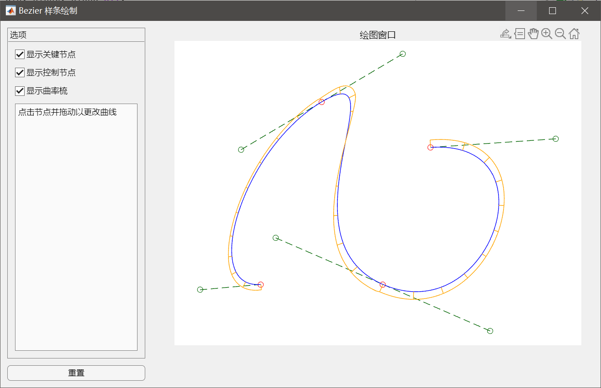

# Bezier Curve Visualizer

一个简单的 MATLAB 程序，绘制一个可拖拽的 Bezier 曲线。

## 使用方法
在 MATLAB 中运行 `main.m` 即可。本程序编写于 MATLAB R2023b，建议使用不低于此版本的 MATLAB 运行。

## 代码结构
### Bezier 样条曲线函数生成
此部分包含文件 [`CubicBezierSpline.m`](src/CubicBezierSpline.m)，[`cubicBezierNormal.m`](src/cubicBezierNormal.m) 和 [`bezier_curve.m`](src/bezier_curve.m)。

[`CubicBezierSpline.m`](src/CubicBezierSpline.m) 定义了三次 Bezier 样条类型，其中包括根据给定初始点生成满足 C2 连续性且较为平滑的 Bezier 样条的构造函数，以及返回样条对应的参数曲线和样条法向量对应参数曲线的函数句柄的函数。

[`cubicBezierNormal.m`](src/cubicBezierNormal.m)  使用公式计算给定三次 Bezier 曲线的法向量，并返回对应的函数句柄。

[`bezier_curve.m`](src/bezier_curve.m) 能够根据给定的若干个点，计算以这些点为节点的 𝑛 次 Bezier 曲线，并返回对应的参数曲线函数句柄。

### UI 控制界面
此部分包含文件 [`main.m`](src/main.m)。

[`main.m`](src/main.m) 中使用了 MATLAB 的 uifigure 功能，创建了一个包含若干个勾选栏和一个坐标区的 UI 界面，并使用鼠标回调函数为坐标区添加了拖拽节点的功能。

## TODO
代码设计中，为增加、删除样条节点预留了接口，并且增加节点的主要功能已经编写完成；还考虑了绘制多条样条曲线的功能，以及修改节点的几何连续性以进行字体设计的功能，但由于时间紧迫，上述功能均未来得及实现。
